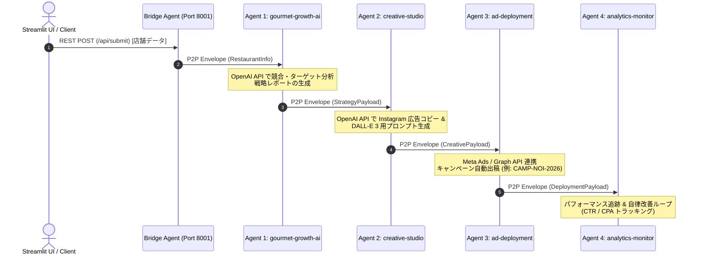

# Next Flow Marketing - Autonomous Multi-Agent System

Fetch.ai (AgentVerse / uAgents) を基盤とした、外食産業特化の自律型マーケティングマルチエージェントシステムです。
Streamlit UI をトリガーに、4台の自律型エージェントが P2P メッセージ通信で連鎖（Agent-to-Agent）し、市場分析から広告作成、自動出稿、パフォーマンス監視までを即時に完全自動実行します。

---

## 📐 システムアーキテクチャ & 通信フロー


## 🤖 稼働エージェント一覧 (AgentVerse Hosted)
```
Agent 名アドレス役割gourmet-growth-aiagent1qg2duhy74kd8xwa9u5wjjtns8jwqxykxt44h0ms639ce578a4lyrs4tycru  店舗データに基づく市場分析・競合策定・平日集客戦略立案creative-studioagent1qgj6hguesylmq0kswl3mgdt6h7e9h3caa99n972c4vx0frtha7hqzfggukz  戦略に基づく Instagram 広告テキスト・DALL-E 3 バナープロンプト生成ad-deploymentagent1qw4umx64uk5vsk73un499l4gfgyydp5kygwlfpyw2m37e5en0ypju9lwmsf  広告キャンペーンの自動プロビジョニング・出稿処理analytics-monitoragent1q0uajwauh4a3hwejc45lmsfv7c7zd2qzjzhg05n0y8a3635v5djtckz7tds
```
📂 リポジトリ構成
```
next-flow-marketing-agents/
├── README.md                      # プロジェクトドキュメント
├── requirements.txt               # 依存ライブラリ一覧
├── bridge_agent.py                # REST API ↔ P2P 通信の中継エージェント
├── app_client.py                  # Streamlit フロントエンド UI
└── agents/
    ├── agent1_gourmet_growth.py    # 戦略立案エージェント
    ├── agent2_creative_studio.py   # クリエイティブ生成エージェント
    ├── agent3_ad_deployment.py    # 広告出稿エージェント
    └── agent4_analytics_monitor.py # 成果監視エージェント
```
## 🚀 セットアップ & 実行手順
### 1. 依存ライブラリのインストール
```
pip install -r requirements.txt
```
### 2. AgentVerse Secrets の設定
AgentVerse ポータル上の各エージェント（特に gourmet-growth-ai と creative-studio）の Secrets タブで、以下の環境変数を追加します。

Key: OPENAI_API_KEY

Value: sk-proj-...（お使いの OpenAI API キー）

### 3. ローカル Bridge および UI の起動 (Google Colab / Local)
```
import subprocess
import time

# バックグラウンドで中継 Agent と Streamlit UI を起動
subprocess.Popen(["python", "bridge_agent.py"])
time.sleep(3)

subprocess.Popen([
    "streamlit", "run", "app_client.py",
    "--server.port", "8501"
])
```
起動後、http://localhost:8501 からフォームを送信すると、AgentVerse 上の 4 台のエージェント群へタスクが投入され、自律連鎖処理が実行されます。
```
