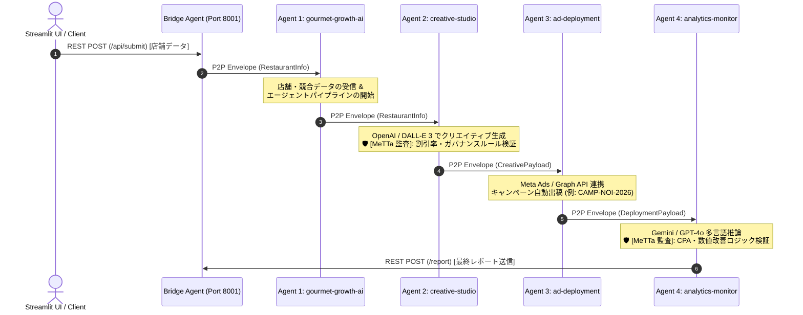

# Next Flow Marketing - Autonomous Multi-Agent System (with Neuro-Symbolic Logic Engine)

Fetch.ai (AgentVerse / uAgents) を基盤とした、外食産業特化の自律型マーケティングマルチエージェントシステムです。
Streamlit UI をトリガーに、4台の自律型エージェントが P2P メッセージ通信で連鎖（Agent-to-Agent）し、市場分析から広告作成、自動出稿、パフォーマンス監視までを即時に完全自動実行します。

本システムは **SingularityNET の OpenCog Hyperon (MeTTa)** を統合しており、LLM（Gemini / GPT-4o）が持つ柔軟なアイデア生成力と、MeTTa による厳格な記号論理・ビジネスルール検証を融合させた **ニューロ・シンボリック（Neuro-Symbolic）構成** で動作します。

---

## 📐 システムアーキテクチャ & 通信フロー


Agent 名,アドレス,役割 & 搭載ロジック
gourmet-growth-ai,agent1qg2duhy74kd8xwa9u5wjjtns8jwqxykxt44h0ms639ce578a4lyrs4tycru,店舗データに基づく市場分析・競合策定・平日集客戦略立案のエントリーポイント
creative-studio,agent1qgj6hguesylmq0kswl3mgdt6h7e9h3caa99n972c4vx0frtha7hqzfggukz,Instagram 広告コピー & DALL-E 3 画像生成。🛡️ MeTTa 統合: オファー・割引率（Max 15%）の自動ガードレール検証
ad-deployment,agent1qw4umx64uk5vsk73un499l4gfgyydp5kygwlfpyw2m37e5en0ypju9lwmsf,広告キャンペーンの自動プロビジョニング・出稿処理（ID割り当て・パラメータ検証）
analytics-monitor,agent1q0uajwauh4a3hwejc45lmsfv7c7zd2qzjzhg05n0y8a3635v5djtckz7tds,Gemini / GPT-4o によるパフォーマンス自律診断。🛡️ MeTTa 統合: CPA許容限界のロジック監査＆最終レポート調整
```
```
## 📂 リポジトリ構成
```
    next-flow-marketing-agents/
├── README.md                      # プロジェクトドキュメント
├── requirements.txt               # 依存ライブラリ一覧 (hyperon, openai, uagents 等)
├── bridge_agent.py                # REST API ↔ P2P 通信の中継エージェント
├── app_client.py                  # Streamlit フロントエンド UI
└── agents/
    ├── agent1_gourmet_growth.py   # 戦略立案エージェント
    ├── agent2_creative_studio.py  # クリエイティブ生成 & MeTTa 監査エージェント
    ├── agent3_ad_deployment.py    # 広告出稿エージェント
    └── agent4_analytics_monitor.py# 成果監視 & MeTTa 推論監査エージェント
    next-flow-marketing-agents/
├── README.md                      # プロジェクトドキュメント
├── requirements.txt               # 依存ライブラリ一覧 (hyperon, openai, uagents 等)
├── bridge_agent.py                # REST API ↔ P2P 通信の中継エージェント
├── app_client.py                  # Streamlit フロントエンド UI
└── agents/
    ├── agent1_gourmet_growth.py   # 戦略立案エージェント
    ├── agent2_creative_studio.py  # クリエイティブ生成 & MeTTa 監査エージェント
    ├── agent3_ad_deployment.py    # 広告出稿エージェント
    └── agent4_analytics_monitor.py# 成果監視 & MeTTa 推論監査エージェント
    
```
🛡️ MeTTa (Neuro-Symbolic) ガードレール設計
LLM（大規模言語モデル）の出力結果におけるハルシネーションや不適切なオファー出力を完全に防ぐため、以下の MeTTa（Atomspace）論理検証レイヤーが組み込まれています。

オファー率・価格制約の検証 (Agent 2)

LLM の提案した割引率を MeTTa に流し込み、店舗のビジネスルール（例: 割引率は最高 15% まで）を満たしているかをパターンマッチングで評価。上限超過時は自動補正。

CPA・改善指示の論理検証 (Agent 4)

キャンペーンの CPA（顧客獲得単価）数値を MeTTa が評価し、目標値（$10.00）を超過している場合は高利益率施策への切り替え注記を自動的にレポートへ追加。

## 🚀 セットアップ & 実行手順
1. 依存ライブラリのインストール
 ```
    pip install -r requirements.txt
 ```
#※ requirements.txt には hyperon（OpenCog Hyperon SDK）が含まれています。

2. AgentVerse Secrets の設定
AgentVerse ポータル上の各エージェントの Secrets タブで、必要に応じて以下の環境変数を追加します。

OPENAI_API_KEY: sk-proj-...

GEMINI_API_KEY: AIzaSy...

OUTPUT_LANGUAGE: Japanese (または English, Traditional Chinese 等)

3. ローカル Bridge および UI の起動 (Google Colab / Local)
```
    import subprocess
import time

# バックグラウンドで中継 Agent と Streamlit UI を起動
subprocess.Popen(["python", "bridge_agent.py"])
time.sleep(3)

subprocess.Popen([
    "streamlit", "run", "app_client.py",
    "--server.port", "8501"
])
```
起動後、http://localhost:8501 からフォームを送信すると、AgentVerse 上の 4 台のエージェント群へタスクが投入され、MeTTa 監査を経由した安全な自律連鎖処理が実行されます。
```
